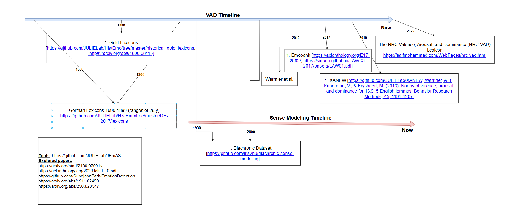
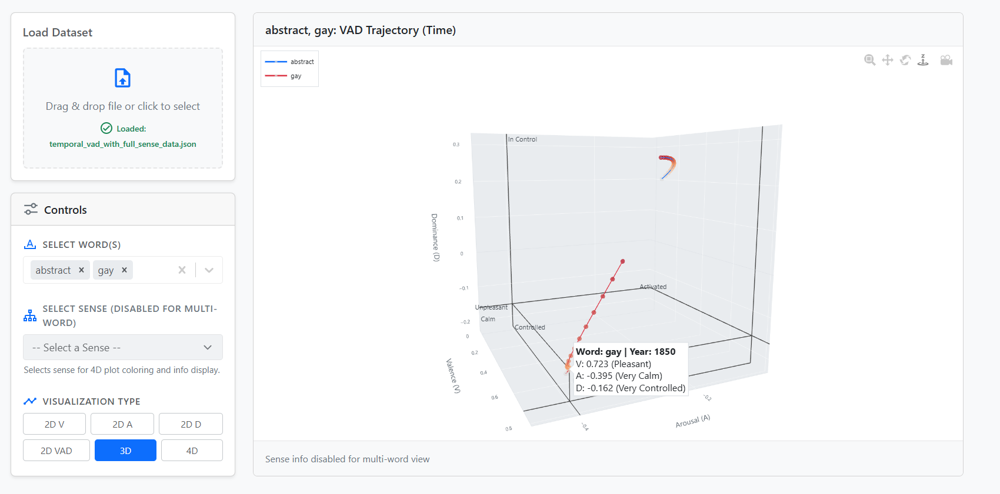
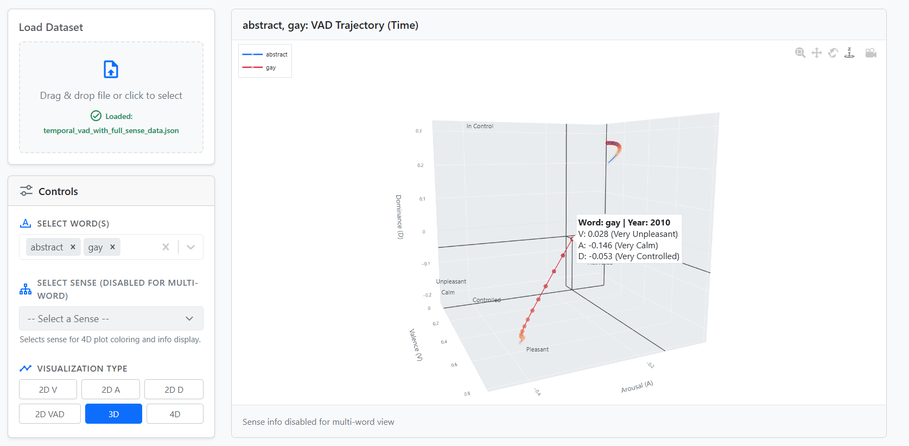

# EmoTracker
EmoTracker is a framework for modeling how emotional associations of words—represented by Valence, Arousal, and Dominance (VAD)—evolve over time. Unlike traditional emotion lexicons that treat word affect as static, EmoTracker combines **sense-aware temporal embeddings** with the **NRC-VAD lexicon** to infer diachronic emotional trajectories for English words.

We release:

* A synthetic diachronic VAD dataset generated using sense clusters from Hu et al. (2019) and interpolated NRC-VAD values.
* A visualization dashboard to explore VAD trends across decades.

---

## Motivation

Words like *gay*, *virus*, and *liberal* have undergone emotional and semantic shifts over time. Existing resources (e.g., NRC-VAD) provide static affective values:

* *gay* → Valence: 8.5, Arousal: 5.3, Dominance: 6.0 (unchanging)

However, emotional meanings shift over time along with senses. RoVERTaD aims to model:

```
VAD(w, t) = f(w, t, s_t)     where s_t is the dominant sense of w at time t
```

The goal is to construct a temporal function over t that reflects these affective drifts.

---

## Dataset Construction

We generate VAD trajectories for 2,000+ frequent English words across decades (1850–2000) using:

1. **Temporal Sense Clusters**
   From Hu et al. (2019), each word `w` has sense embeddings `e_{w, t}^{(s)}` for each sense `s` over time `t`.

2. **Mapping Senses to VAD**
   For each sense embedding, we compute an approximate VAD score by retrieving k-nearest neighbors from a VAD-annotated embedding space:

```
VAD(w, t, s) = (1/k) * sum_i VAD(n_i)
```

Where `n_i` are the k nearest neighbors from the NRC-VAD space.

3. **Weighted Averaging Across Senses**
   Using sense probabilities `p(s_t)` from Hu et al., we compute a weighted average:

```
VAD(w, t) = sum_s p(s_t) * VAD(w, t, s)
```
**\[State of the art datasets]**

****

---

## Model Architecture

**still in progress**...

---

## Evaluation

We evaluate on:

* Pearson and Spearman correlation with gold VAD values (static NRC-VAD and synthetic)
* Generalization across decades (train on 1850–1950, test on 1960–2000)
* Case studies: *gay*, *queer*, *liberal*, *pandemic*

---

## Visualization Dashboard

We provide a React frontend to explore word-level VAD trajectories over time. Users can:

* Plot Valence, Arousal, and Dominance trends individually
* Compare multiple words
* Hover to inspect changes and peak shift decades

**\[Word: Gay in 1850]**


**\[Word: Gay in 2010]**

---

## Project Structure

```
EmoTracker/
│
├── data/
│   ├── raw/                 # Hu et al.'s sense data
│   ├── processed/           # Generated diachronic VAD dataset
│
├── vad_generator/           # Scripts to compute temporal VAD
│   └── generate_vad.py
│
├── model/                   # RoBERTa training + inference
│   ├── train.py
│   └── vad_model.py
│
├── dashboard/               # React-based VAD visualizer
│   └── src/
│
├── requirements.txt
└── README.md
```

---

## Run the Project

1. Install dependencies:

```bash
pip install -r requirements.txt
```

2. Generate the diachronic VAD dataset:

```bash
python vad_generator/generate_vad.py
```

3. Train the RoBERTa model:

```bash
python model/train.py --epochs 5
```

4. Launch the visualization dashboard:

```bash
cd dashboard/
npm install && npm start
```

---

## References

* Hu et al. (2019). *Diachronic Sense Modeling with Deep Contextualized Word Embeddings*. ACL 2019. [Link](https://aclanthology.org/P19-1131)
* Mohammad (2018). *Obtaining Reliable Human Ratings of Valence, Arousal, and Dominance for 20,000 English Words*. LREC 2018. [Link](https://aclanthology.org/L18-1191)

---

## Citation

If you use RoVERTaD, please cite:

```bibtex
@inproceedings{rovertad2025,
  title={RoVERTaD: VAD Inference Over Time with Diachronic Sense Modeling},
  author={Your Name and Collaborators},
  booktitle={ACL 2025 (Short Paper)},
  year={2025}
}
```
