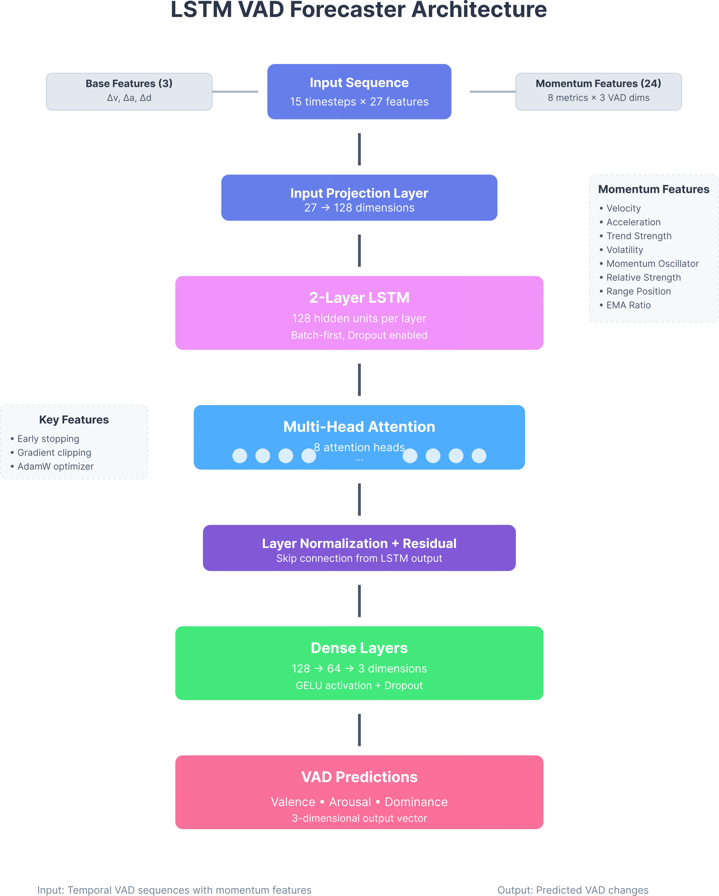
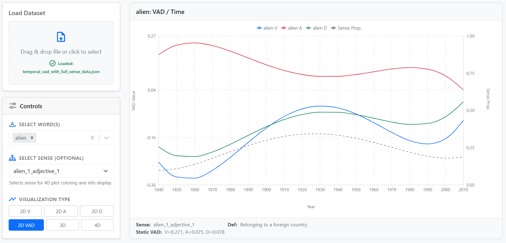
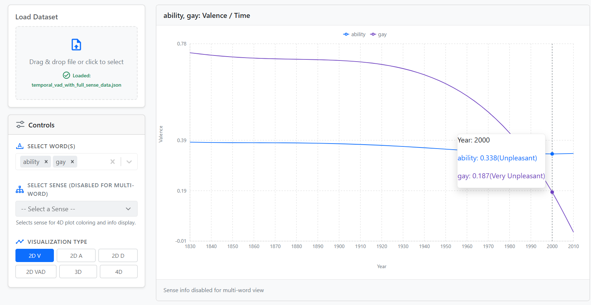

# EmoTracker
EmoTracker is a framework for modeling how emotional associations of words (represented by Valence, Arousal, and Dominance (VAD)) evolve over time. 

Unlike traditional emotion lexicons that treat word affect as static, EmoTracker combines **sense-aware temporal embeddings** with the **NRC-VAD lexicon** to infer diachronic emotional trajectories for English words.

We release:

* A synthetic diachronic VAD dataset generated using sense clusters from Hu et al. (2019) and interpolated NRC-VAD values.
* A visualization dashboard to explore VAD trends across decades.

---

## Motivation

Words like *gay*, *virus*, and *liberal* have undergone emotional and semantic shifts over time. Existing resources (e.g., NRC-VAD) provide static affective values:

* *gay* → Valence: 8.5, Arousal: 5.3, Dominance: 6.0 (unchanging)

However, emotional meanings shift over time along with senses. EmoTracker aims to model:

```
VAD(w, t) = f(w, t, s_t)     where s_t is the dominant sense of w at time t
```

The goal is to construct a temporal function over t that reflects these affective drifts.

---

## Dataset Construction

We generate VAD trajectories for 2,000+ frequent English words across decades (1850–2000) using:

1. **Temporal Sense Clusters**
   From Hu et al. (2019), each word `w` has sense embeddings `e_{w, t}^{(s)}` for each sense `s` over time `t`.

2. **Mapping Senses to VAD**
   For each sense embedding, we compute an approximate VAD score by retrieving k-nearest neighbors from a VAD-annotated embedding space:

```
VAD(w, t, s) = (1/k) * sum_i VAD(n_i)
```

Where `n_i` are the k nearest neighbors from the NRC-VAD space.

3. **Weighted Averaging Across Senses**
   Using sense probabilities `p(s_t)` from Hu et al., we compute a weighted average:

```
VAD(w, t) = sum_s p(s_t) * VAD(w, t, s)
```
**\[State of the art datasets]**

****

---

## Model Architecture

### Enhanced LSTM VAD Forecaster

EmoTracker employs an advanced deep learning model that combines **LSTM neural networks** with **sophisticated momentum feature engineering** and **attention mechanisms** to capture complex temporal patterns in emotional word semantics.

#### Core Components

**1. Enhanced LSTM with Attention**
- Multi-layer LSTM with configurable hidden dimensions (default: 128)
- Multi-head self-attention mechanism (8 heads)
- Layer normalization and residual connections
- Input projection for optimal feature transformation

**2. Advanced Momentum Features**

The model computes **8 momentum features** per VAD dimension, totaling **27 input features** per timestep:

- **Base Features (3)**: VAD difference values (Δv, Δa, Δd)
- **Momentum Features (24)**: 8 metrics × 3 VAD dimensions
  - **Velocity**: Linear regression slope indicating trend direction/speed
  - **Acceleration**: Second derivative capturing rate of change in velocity
  - **Trend Strength**: R-value weighted by direction for consistency
  - **Volatility**: Standard deviation measuring uncertainty/variability
  - **Momentum Oscillator**: Recent change relative to historical volatility
  - **Relative Strength**: First vs second half comparison within window
  - **Range Position**: Current value position within historical min/max range
  - **EMA Ratio**: Exponential vs Simple Moving Average relationship

**3. Architecture Overview**


****

---
#### Training Pipeline

The model uses difference-based modeling for temporal trajectory modelling:

```
VAD_pred(t+1) = VAD_actual(t) + Δ_pred(t+1)
```

Where `Δ_pred(t+1)` is the predicted change in VAD values.

**Training Configuration:**
- **Lookback Window**: 15 timesteps
- **Optimizer**: AdamW with weight decay (1e-5)
- **Learning Rate**: 0.0005 with ReduceLROnPlateau scheduling
- **Regularization**: Dropout (0.2), gradient clipping (1.0)
- **Early Stopping**: Patience of 10 epochs on validation loss

#### Key Advantages

- **Rich Temporal Modeling**: 8 sophisticated momentum features vs simple difference concatenation
- **Long-Range Dependencies**: Multi-head attention captures sequence relationships
- **Robust Training**: Early stopping, gradient clipping, best model saving
- **Production Ready**: Complete model persistence with scalers and configuration

The LSTM forecaster allows modeling of how word emotions evolve across historical periods, capturing both linear trends and complex non-linear patterns in VAD trajectories.

---

## Evaluation

We evaluate on:

* Pearson and Spearman correlation with gold VAD values (static NRC-VAD and synthetic)
* Generalization across decades (train on 1850–1950, test on 1960–2000)
* Case studies: *gay*, *queer*, *liberal*, *pandemic*
* **LSTM Performance**: MAE and RMSE on reconstructed VAD values across test periods

---

## Visualization Dashboard

We provide a React frontend to explore word-level VAD trajectories over time. Users can:

* Plot Valence, Arousal, and Dominance trends individually
* Compare multiple words
* Hover to inspect changes and peak shift decades

**\[Word: Gay in 1850]**


**\[Word: Gay in 2010]**


**\[VAD 2D Visualizator]**


**\[Valence 2D Visualizator]**


---

## Project Structure

```
EmoTracker/
│
├── data/
│   ├── raw/                 # Hu et al.'s sense data
│   ├── processed/           # Generated diachronic VAD dataset
│   └── Generated_VAD_Dataset/  # LSTM training data
│
├── vad_generator/           # Scripts to compute temporal VAD
│   └── generate_vad.py
│
├── model/                   # RoBERTa training + inference
│   ├── train.py
│   └── vad_model.py
│
├── lstm_forecaster/         # Enhanced LSTM VAD prediction
│   ├── enhanced_lstm_vad_forecaster.py
│   └── model_assets_pytorch/   # Trained models and configs
│
├── dashboard/               # React-based VAD visualizer
│   └── src/
│
├── requirements.txt
└── README.md
```

---

## Run the Project

1. Install dependencies:

```bash
pip install -r requirements.txt
```

2. Generate the diachronic VAD dataset:

```bash
python vad_generator/generate_vad.py
```

3. Train the Enhanced LSTM model:

```bash
python lstm_forecaster/enhanced_lstm_vad_forecaster.py
```

4. Train the RoBERTa model:

```bash
python model/train.py --epochs 5
```

5. Launch the visualization dashboard:

```bash
cd dashboard/
npm install && npm start
```

---

## References

* Hu et al. (2019). *Diachronic Sense Modeling with Deep Contextualized Word Embeddings*. ACL 2019. [Link](https://aclanthology.org/P19-1131)
* Mohammad (2018). *Obtaining Reliable Human Ratings of Valence, Arousal, and Dominance for 20,000 English Words*. LREC 2018. [Link](https://aclanthology.org/L18-1191)

---