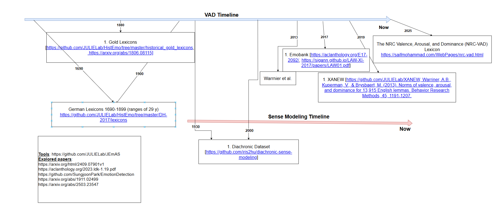
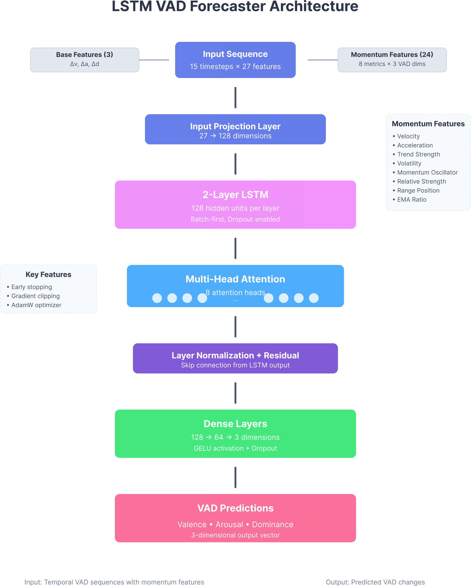
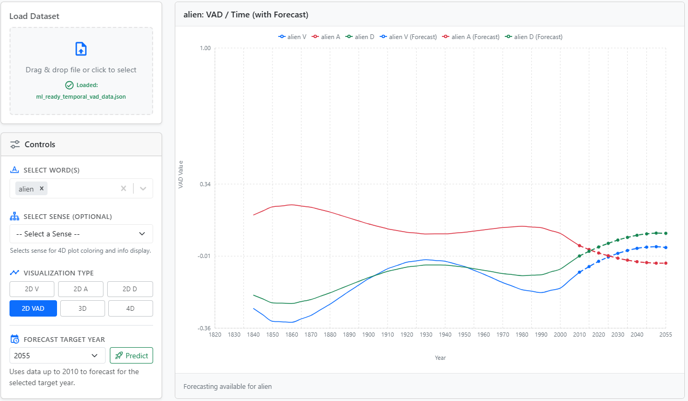
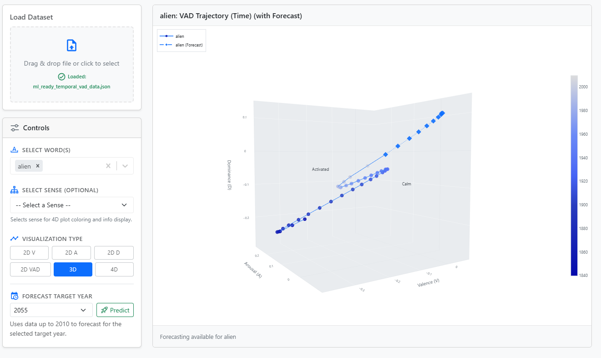
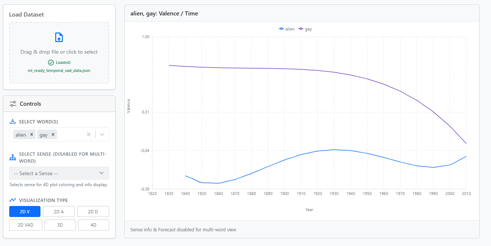

# EmoTracker - Temporal VAD Emotion Tracking System

> "The emotions are often the masters of reason."  
> — *Sigmund Freud, paraphrasing from* **The Ego and the Id** *(1923)*

EmoTracker is an advanced framework for modeling how emotional associations of words (represented by Valence, Arousal, and Dominance (VAD)) evolve over time and forecast their evolution.

Unlike traditional emotion lexicons that treat word affect as static, EmoTracker combines **sense-aware temporal embeddings** with the **NRC-VAD lexicon** to infer diachronic emotional trajectories for English words. 

It also uses a **LSTM architecture** with **advanced momentum-based feature engineering** and **multi-head attention mechanisms** to predict diachronic emotional trajectories for English words.

## Table of Contents

- [Key Features](#key-features)
- [Motivation](#motivation)
- [Dataset Construction](#dataset-construction)
- [LSTM Architecture](#lstm-architecture)
  - [Advanced Momentum Feature Engineering](#advanced-momentum-feature-engineering)
  - [Neural Architecture Components](#neural-architecture-components)
  - [Architecture Overview](#architecture-overview)
- [Project Structure](#project-structure)
- [Getting Started](#getting-started)
  - [1. Install Dependencies](#1-install-dependencies)
  - [2. Generate Temporal VAD Dataset](#2-generate-temporal-vad-dataset)
  - [3. Train LSTM Model](#3-train-lstm-model)
  - [4. Launch Prediction API](#4-launch-prediction-api)
  - [5. Start Visualization Dashboard](#5-start-visualization-dashboard)
- [Components](#components)
  - [API Backend](#api-backend)
  - [Client Dashboard](#client-dashboard)
  - [Dataset Generation](#dataset-generation)
  - [Model Training](#model-training)
- [Visualization Dashboard Features](#visualization-dashboard-features)
  - [Dashboard Screenshots](#dashboard-screenshots)
- [Model Performance](#model-performance)
- [Innovations](#innovations)
- [Research Applications](#research-applications)
- [References](#references)

---

## Key Features

* **LSTM with Advanced Momentum Tracking**: 8 sophisticated momentum features per VAD dimension capturing velocity, acceleration, volatility, and trend patterns
* **Interactive Visualization Dashboard**: React-based platform for exploring temporal VAD trajectories
* **Automated Dataset Generation**: Pipeline for creating diachronic VAD datasets from sense modeling data
* **Multi-dimensional Analysis**: Support for 2D, 3D, and 4D VAD visualizations with forecasting capabilities

---

## Motivation

Words like *gay*, *virus*, *abandon*, and *liberal* have undergone emotional and semantic shifts over time. Existing resources provide static affective values, but EmoTracker models dynamic emotional evolution:

```
VAD(w, t+Δt) = LSTM(momentum_features(VAD_history(w, t-n:t)))
```

Where momentum features include 
- velocity 
- acceleration 
- trend strength 
- volatility
- temporal oscillators.

---

## Dataset Construction

We generate VAD trajectories for 2,000+ frequent English words across decades (1850–2000) using:

1. **Temporal Sense Clusters**
   From Hu et al. (2019), each word `w` has sense embeddings `e_{w, t}^{(s)}` for each sense `s` over time `t`.

2. **Mapping Senses to VAD**
   For each sense embedding, we compute an approximate VAD score by retrieving k-nearest neighbors from a VAD-annotated embedding space:

```
VAD(w, t, s) = (1/k) * sum_i VAD(n_i)
```

Where `n_i` are the k nearest neighbors from the NRC-VAD space.

3. **Weighted Averaging Across Senses**
   Using sense probabilities `p(s_t)` from Hu et al., we compute a weighted average:

```
VAD(w, t) = sum_s p(s_t) * VAD(w, t, s)
```
**\[State of the art datasets]**

****


---

## LSTM Architecture

### Advanced Momentum Feature Engineering

EmoTracker Model uses **27 input features** per timestep, combining base VAD differences with momentum tracking:

**Base Features (3)**:
- Δv, Δa, Δd (VAD difference values)

**Advanced Momentum Features (24)**: 8 metrics × 3 VAD dimensions
- **Velocity**: Linear regression slope indicating trend direction and speed
- **Acceleration**: Second derivative capturing rate of change in velocity  
- **Trend Strength × Direction**: R-value weighted by trend direction for consistency
- **Volatility**: Standard deviation measuring uncertainty and variability
- **Momentum Oscillator**: Recent change relative to historical volatility
- **Relative Strength**: First vs second half comparison within sliding window
- **Range Position**: Current value position within historical min/max range
- **EMA Ratio**: Exponential vs Simple Moving Average relationship

### Neural Architecture Components

**LSTM Core**:
```
EnhancedLSTMForecast(
  (input_projection): Linear(in_features=27, out_features=128, bias=True)
  (lstm): LSTM(128, 128, num_layers=2, batch_first=True, dropout=0.2)
  (attention): MultiheadAttention(8 heads, embed_dim=128)
  (layer_norm1): LayerNorm((128,), eps=1e-05, elementwise_affine=True)
  (layer_norm2): LayerNorm((128,), eps=1e-05, elementwise_affine=True)
  (fc1): Linear(in_features=128, out_features=64, bias=True)
  (fc2): Linear(in_features=64, out_features=3, bias=True)
  (dropout): Dropout(p=0.2, inplace=False)
  (activation): GELU(approximate='none')
)
```

**Training Pipeline**:
- **Difference-based modeling**: `VAD_pred(t+1) = VAD_actual(t) + Δ_pred(t+1)`
- **Lookback Window**: 15 timesteps for temporal context
- **Optimizer**: AdamW with weight decay and learning rate scheduling
- **Regularization**: Dropout (0.2), gradient clipping, early stopping

### Architecture Overview

****

The LSTM architecture with momentum feature engineering, multi-head attention, and residual connections enables temporal VAD prediction with exceptional accuracy.

---

## Project Structure

```
EmoTracker/
│
├── api/                           # Flask API Backend
│   ├── __init__.py
│   ├── api_request_example.http   # Example API requests
│   ├── config.py                  # Resource loading and model configuration
│   ├── features.py                # Advanced momentum feature engineering
│   ├── models.py                  # LSTM model definition
│   ├── prediction.py              # Iterative VAD trajectory prediction
│   ├── wsgi.py                    # Flask web server and API endpoints
│   ├── forecasting_empirical_evaluation.py  # Performance evaluation script
│   ├── requirements.txt           # Python dependencies
│   ├── Dockerfile                 # Container configuration
│   ├── README.md                  # API documentation
│   └── forecasting_evaluation_results/
│       ├── __init__.py
│       ├── word_performance_results.csv      # Performance metrics
│       ├── analysis_report.txt               # Detailed analysis
│       └── performance_summary.txt           # Statistical summary
│
├── src/
│   ├── dataset/                   # Dataset Generation Pipeline
│   │   ├── __init__.py
│   │   ├── datasets_generation.py     # VAD dataset creation from sense data
│   │   ├── datasets_evaluation.py     # Dataset quality evaluation
│   │   ├── format_converter.py        # Pickle to JSON conversion utilities
│   │   ├── nrc_dataset_generation.py  # NRC-specific dataset processing
│   │   └── nrc_evaluation.py         # NRC dataset evaluation
│   │
│   └── model/                     # LSTM Training Pipeline
│       ├── __init__.py
│       ├── config.py              # Training hyperparameters and paths
│       ├── dataset.py             # PyTorch dataset wrapper
│       ├── main.py                # Training orchestration
│       ├── model.py               # LSTM architecture
│       ├── preprocessing.py       # Feature engineering and data preparation
│       ├── trainer.py             # Training loop with validation and metrics
│       └── utils.py               # Utility functions and helpers
│
├── client/                        # React Visualization Dashboard
│   ├── src/                       # Interactive VAD trajectory visualizations
│   ├── package.json              # Node.js dependencies
│   └── README.md                 # Dashboard documentation
│
├── data/
│   ├── Generated_VAD_Dataset/     # ML-ready temporal VAD data
│   │   ├── dataset_nrc/           # NRC lexicon-based datasets
│   │   ├── dataset_warriner/      # Warriner lexicon-based datasets
│   │   ├── dataset_memolon/       # MEmoLon lexicon-based datasets
│   │   └── dataset_evaluator.py   # Dataset quality evaluation
│   ├── model_assets_pytorch/      # Trained models and configurations
│   ├── evaluation_results/        # Dataset evaluation outputs
│   ├── Diachronic_Sense_Modeling/ # Input sense modeling data
│   ├── VAD_Lexicons/             # Reference VAD lexicons
│   └── imgs/                     # Documentation images
│
├── requirements.txt              # Python dependencies
└── README.md                     # This file
```

---

## Getting Started

### 1. Install Dependencies

```bash
pip install -r requirements.txt
```

### 2. Generate Temporal VAD Dataset

```bash
cd src/dataset/
python datasets_generation.py
```

This creates multiple dataset variants:
- `emotracker_nrc.json` - NRC VAD lexicon-based dataset
- `emotracker_warriner.json` - Warriner et al. lexicon-based dataset  
- `emotracker_memolon.json` - MEmoLon lexicon-based dataset

### 3. Evaluate Dataset Quality (Optional)

```bash
cd src/dataset/
python dataset_evaluator.py
```

Evaluates dataset quality through correlation analysis and performance metrics against gold standard VAD values.

### 4. Train LSTM Model

```bash
cd src/model/
python main.py
```

Trains the LSTM with momentum features and saves model assets to `data/model_assets_pytorch/`.

### 5. Launch Prediction API

```bash
cd api/
python wsgi.py
```

Starts Flask API server on `http://localhost:5000` with `/predict` endpoint.

### 6. Start Visualization Dashboard

```bash
cd client/
npm install && npm start
```

Launches React dashboard for interactive VAD trajectory exploration.

### 7. Run Empirical Evaluation (Optional)

```bash
cd api/
python forecasting_empirical_evaluation.py
```

Generates comprehensive performance analysis and evaluation metrics for model validation.

---

## Components

### API Backend

The Flask-based API provides VAD trajectory prediction endpoints with LSTM forecasting capabilities. See [api/README.md](api/README.md) for detailed documentation including:

- **Setup and installation** (Docker and local)
- **API reference** with request/response examples
- **Reproducible analysis** using `forecasting_empirical_evaluation.py`
- **Performance metrics** and evaluation results
- **Configuration** and deployment instructions

### Client Dashboard

Interactive React-based visualization platform for exploring temporal VAD trajectories. See [client/README.md](client/README.md) for comprehensive documentation covering:

- **Multi-dimensional visualizations** (2D, 3D, 4D)
- **Real-time forecasting** with API integration
- **Multi-word comparisons** and trajectory analysis
- **Interactive controls** and customization options
- **Setup and development** instructions

### Dataset Generation

The `src/dataset/` pipeline creates temporal VAD datasets from sense modeling data:

- **`datasets_generation.py`**: Main dataset creation from multiple VAD lexicons
- **`datasets_evaluation.py`**: Quality assessment and correlation analysis
- **`format_converter.py`**: Data format conversion utilities
- **`nrc_dataset_generation.py`**: NRC-specific processing pipeline
- **`nrc_evaluation.py`**: NRC dataset validation and metrics

### Model Training

The `src/model/` pipeline handles LSTM training with momentum features:

- **`main.py`**: Training orchestration and model persistence
- **`model.py`**: LSTM architecture with attention mechanisms
- **`preprocessing.py`**: Advanced momentum feature engineering
- **`trainer.py`**: Training loop with validation and early stopping
- **`dataset.py`**: PyTorch dataset wrapper for temporal sequences
- **`utils.py`**: Utility functions for data processing
- **`config.py`**: Training configuration and hyperparameters

---

## Visualization Dashboard Features

The React-based dashboard provides:

* **Multi-word Comparison**: Plot VAD trajectories for multiple words simultaneously
* **Forecasting Visualization**: Display historical data with predicted future trajectories
* **Multi-dimensional Views**: 
  - 2D plots (V/A/D over time)
  - 3D VAD space visualization
  - 4D plots with sense proportion coloring
* **Interactive Controls**: Word selection, forecast target years, sense filtering
* **Real-time API Integration**: Live predictions through backend API

### Dashboard Screenshots

****

*Figure 3: 2D temporal visualization showing VAD values over time for the word "alien" with forecasting capabilities. Solid lines represent historical data, dotted lines show LSTM predictions.*

****

*Figure 4: 3D VAD space visualization displaying emotional trajectory through valence-arousal-dominance dimensions. Dot shape represents temporal progression from historical (rounded) to predicted (squared) periods.*

****

*Figure 5: Multi-word VAD trajectory comparison showing emotional evolution patterns across different lexical items with synchronized time axes and forecast extensions.*

---
